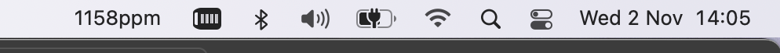

 [](https://badge.fury.io/py/claranet4)

# ClAranet4

Ultra-minimal (i.e. incomplete) Python & CLI client for collecting current readings from Aranet4 Bluetooth sensors. This client uses [Bleak](https://github.com/hbldh/bleak) and should work across platforms, and has been tested on Intel and ARM64 Macs. An xbar plugin for displaying measurements in the MacOS menu bar is included.




## Install

```bash
# Python >= 3.10, setuptools >= 64
pip install claranet4

# Development
git clone https://github.com/bede/claranet4.git
pip install --editable ./claranet4
pip install pytest build black pre-commit
```
Alternatively, use the static binary built from the [latest release](https://github.com/bede/claranet4/releases/)


## CLI usage

```
% claranet4 --help
usage: claranet4 [-h] [--version] {scan,discover,read} ...

positional arguments:
  {scan,discover,read}
    scan                Show nearby Bluetooth devices
    discover            Discover nearby Aranet4 devices
    read                Request latest measurements from a nearby Aranet4 device

options:
  -h, --help            show this help message and exit
  --version             show program's version number and exit
```


Enumerate nearby Aranet4 devices

```bash
% claranet4 discover
INFO: Found 9 device(s)
INFO: Found 1 Aranet4 device(s)
[
    {
        "address": "390F544C-F0FF-F8BE-3A3A-BB1219AA2145",
        "name": "Aranet4 1D6BA",
        "rssi": -71
    }
]
```


Request measurements from an Aranet4 by address. If the device is unpaired, a prompt should appear for the pairing code.

```bash
% claranet4 read 390F544C-F0FF-F8BE-3A3A-BB1219AA2145
INFO: Selected Aranet4 1D6BA (-74dBm)
{
    "name": "Aranet4 1D6BA",
    "address": "390F544C-F0FF-F8BE-3A3A-BB1219AA2145",
    "rssi": -74,
    "co2": 946,
    "temperature": 17.6,
    "pressure": 1002.1,
    "humidity": 73.4
}
```


Executing `claranet4 read` without specifying an address will request measurements from the Aranet4 with the highest received signal strength (RSSI)

```bash
% claranet4 read
INFO: Found 9 device(s)
INFO: Found 1 Aranet4 device(s)
INFO: Selected Aranet4 1D6BA (-74dBm)
{
    "name": "Aranet4 1D6BA",
    "address": "390F544C-F0FF-F8BE-3A3A-BB1219AA2145",
    "rssi": -74,
    "co2": 946,
    "temperature": 17.6,
    "pressure": 1002.1,
    "humidity": 73.4
}
```


## API usage

```python
>>> from claranet4.lib import discover_ara4s, read
>>> discover_ara4s()
INFO: Found 28 device(s)
INFO: Found 1 Aranet4 device(s)
[Device(address='390F544C-F0FF-F8BE-3A3A-BB1219AA2145', name='Aranet4 1D6BA', rssi=-70)]
>>> read("390F544C-F0FF-F8BE-3A3A-BB1219AA2145").__dict__
INFO: Selected Aranet4 1D6BA (-74dBm)
{'name': 'Aranet4 1D6BA', 'address': '390F544C-F0FF-F8BE-3A3A-BB1219AA2145', 'rssi': -74, 'co2': 715, 'temperature': 20.4, 'pressure': 991.4, 'humidity': 63.4}
```


## MacOS menu bar usage

1. Install xbar (https://github.com/matryer/xbar).
2. Download the MacOS executable for the latest release of Claranet4 https://github.com/bede/claranet4/releases).
3. Download the xbar plugin `claranet4.2m.sh` from the xbar directory of this repository. Change the path at the bottom of this file to point to wherever your executable is stored.
4. Open xbar, and open your plugins folder. Put `claranet4.2m.sh` inside it.
5. Open System Preferences -> Security and Privacy and grant xbar permissions for Bluetooth, Automation and Developer Tools.
